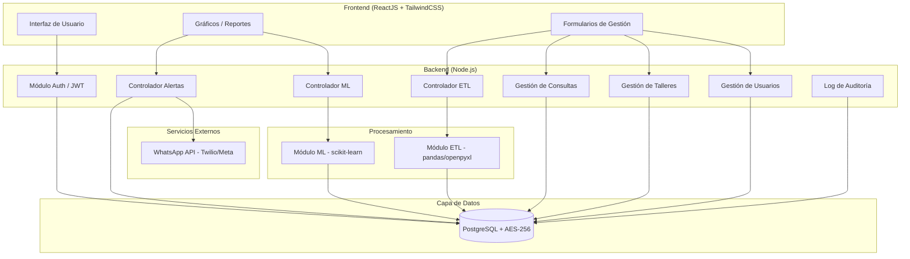
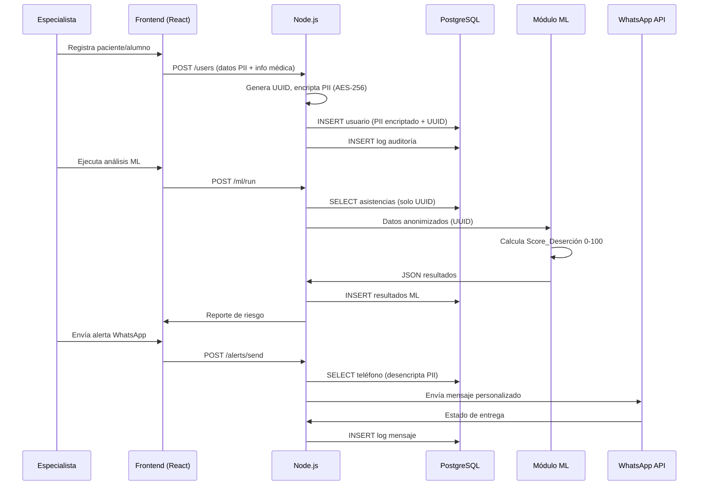
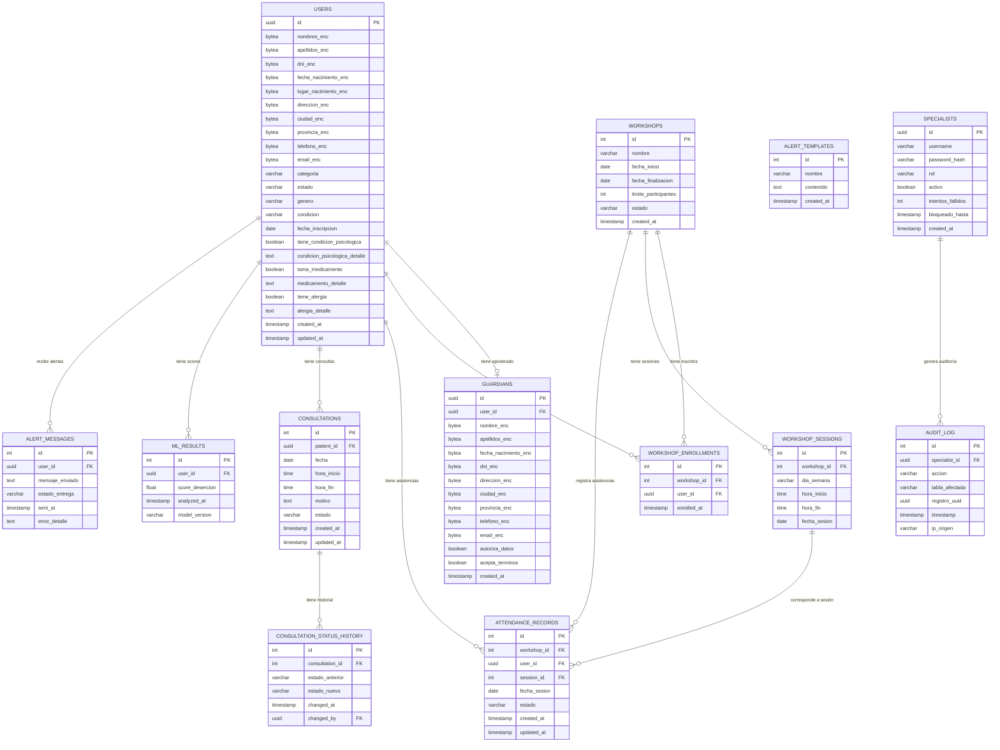

# Documento de Diseño Técnico — Mente Oasis Sistema

## Descripción General

El Sistema de Análisis Predictivo y Gestión "Mente Oasis" es una plataforma integral para **Mente Oasis Servicios Psicológicos** que combina gestión clínica en tiempo real con análisis predictivo de deserción basado en Machine Learning. El sistema protege datos sensibles de salud mental mediante encriptación AES-256 y anonimización por UUID, opera inicialmente en entorno local con Docker Compose, y está diseñado para migración futura a la nube sin cambios en el código de negocio.

### Objetivos de Diseño

- **Seguridad primero**: PII encriptado en reposo; ML opera exclusivamente sobre UUIDs.
- **Separación de responsabilidades**: Frontend, API, Base de Datos, ETL y ML son capas independientes.
- **Agnóstico a infraestructura**: Toda configuración externalizada en variables de entorno; contenedores Docker.
- **Ética en IA**: El score de deserción apoya al especialista, no reemplaza el criterio clínico.

---

## Arquitectura

### Diagrama de Arquitectura General



### Flujo de Datos Principal



### Decisiones de Diseño

| Decisión | Elección | Justificación |
|---|---|---|
| Backend | Node.js (JavaScript) | Ecosistema JavaScript/TypeScript; integración con frontend; OpenAPI con herramientas Node |
| Base de datos | PostgreSQL | Soporte nativo para extensiones de encriptación; robustez relacional; migrable a RDS |
| Encriptación PII | AES-256 a nivel aplicación (pgcrypto) | Control explícito sobre qué campos se encriptan; compatible con anonimización UUID |
| ML | scikit-learn | Madurez, documentación, compatibilidad con pandas; suficiente para análisis de deserción |
| ETL | pandas + openpyxl | Estándar de facto para .xls/.csv en Python |
| WhatsApp | Twilio o Meta Cloud API | Ambas soportan mensajería programática; configurable por variable de entorno |
| Contenedores | Docker Compose | Despliegue local con un comando; migrable a ECS/Kubernetes sin cambios de código |

---

## Componentes e Interfaces

### Estructura de Directorios

```
mente-oasis/
├── frontend/                    # ReactJS + TailwindCSS
│   ├── src/
│   │   ├── components/          # Componentes reutilizables
│   │   ├── pages/               # Vistas principales
│   │   ├── hooks/               # Custom hooks
│   │   ├── services/            # Clientes API (axios)
│   │   └── store/               # Estado global (Zustand/Context)
│   └── Dockerfile
├── backend/                     # Node.js
│   ├── app/
│   │   ├── api/                 # Routers Node.js
│   │   │   ├── auth.py
│   │   │   ├── users.py
│   │   │   ├── workshops.py
│   │   │   ├── consultations.py
│   │   │   ├── etl.py
│   │   │   ├── ml.py
│   │   │   └── alerts.py
│   │   ├── core/
│   │   │   ├── security.py      # JWT + AES-256
│   │   │   ├── config.py        # Variables de entorno
│   │   │   └── audit.py         # Log de auditoría
│   │   ├── models/              # Modelos SQLAlchemy
│   │   ├── schemas/             # Schemas Pydantic
│   │   ├── services/            # Lógica de negocio
│   │   └── main.py
│   ├── etl/
│   │   └── processor.py         # pandas + openpyxl
│   ├── ml/
│   │   └── desertion_model.py   # scikit-learn
│   ├── requirements.txt
│   └── Dockerfile
├── docker-compose.yml
└── .env.example
```

### Endpoints de la API (Node.js)

#### Autenticación
| Método | Ruta | Descripción |
|---|---|---|
| POST | `/auth/login` | Autenticación, retorna JWT |
| POST | `/auth/logout` | Invalida sesión |
| POST | `/auth/refresh` | Renueva token JWT |

#### Usuarios
| Método | Ruta | Descripción |
|---|---|---|
| POST | `/users` | Crear usuario (paciente/alumno/ambos) |
| GET | `/users/{uuid}` | Obtener perfil (desencripta PII) |
| PUT | `/users/{uuid}` | Actualizar usuario |
| GET | `/users` | Listar usuarios (sin PII) |
| GET | `/users/{uuid}/history` | Historial completo del usuario |

#### Talleres
| Método | Ruta | Descripción |
|---|---|---|
| POST | `/workshops` | Crear taller |
| GET | `/workshops` | Listar talleres |
| PUT | `/workshops/{id}` | Editar taller (si no ha iniciado) |
| POST | `/workshops/{id}/enroll` | Inscribir usuario |
| POST | `/workshops/{id}/attendance` | Registrar asistencia |
| PUT | `/workshops/{id}/attendance/{record_id}` | Modificar asistencia (24h) |

#### Consultas
| Método | Ruta | Descripción |
|---|---|---|
| POST | `/consultations` | Agendar consulta |
| GET | `/consultations` | Listar consultas (filtros: estado, fecha, uuid) |
| PUT | `/consultations/{id}/status` | Cambiar estado |

#### ETL
| Método | Ruta | Descripción |
|---|---|---|
| POST | `/etl/upload` | Subir archivo .xls/.csv |
| GET | `/etl/jobs/{job_id}` | Estado del proceso ETL |

#### ML
| Método | Ruta | Descripción |
|---|---|---|
| POST | `/ml/run` | Ejecutar análisis manual |
| GET | `/ml/results` | Obtener últimos resultados |
| GET | `/ml/config` | Obtener configuración de ejecución automática |
| PUT | `/ml/config` | Actualizar intervalo de ejecución automática |

#### Alertas
| Método | Ruta | Descripción |
|---|---|---|
| GET | `/alerts/report` | Reporte de usuarios en riesgo |
| POST | `/alerts/send` | Enviar mensajes WhatsApp |
| GET | `/alerts/templates` | Listar plantillas de mensajes |
| POST | `/alerts/templates` | Crear plantilla |

#### Talleres — Análisis
| Método | Ruta | Descripción |
|---|---|---|
| GET | `/workshops/analytics` | Reporte de talleres por tasa de deserción |
| GET | `/workshops/{id}/analytics` | Detalle de asistencias y scores de un taller |

---

## Modelos de Datos

### Diagrama Entidad-Relación



### Notas sobre Encriptación

- Los campos `*_enc` son de tipo `bytea` y se encriptan/desencriptan a nivel de aplicación usando la extensión `pgcrypto` de PostgreSQL con AES-256.
- La clave de encriptación se almacena exclusivamente en variables de entorno (`ENCRYPTION_KEY`), nunca en el código fuente.
- El módulo ML y ETL **nunca** reciben campos `*_enc`; solo operan con el `uuid` del usuario.

### Estrategia de Encriptación AES-256

```python
# backend/app/core/security.py (esquema conceptual)
from cryptography.fernet import Fernet
import os

ENCRYPTION_KEY = os.environ["ENCRYPTION_KEY"]

def encrypt_pii(value: str) -> bytes:
    f = Fernet(ENCRYPTION_KEY)
    return f.encrypt(value.encode())

def decrypt_pii(encrypted: bytes) -> str:
    f = Fernet(ENCRYPTION_KEY)
    return f.decrypt(encrypted).decode()
```

---

## Propiedades de Corrección

*Una propiedad es una característica o comportamiento que debe mantenerse verdadero en todas las ejecuciones válidas del sistema — esencialmente, una declaración formal sobre lo que el sistema debe hacer. Las propiedades sirven como puente entre las especificaciones legibles por humanos y las garantías de corrección verificables por máquinas.*

---

### Propiedad 1: Round-trip de encriptación PII

*Para cualquier* valor de campo PII (nombre, apellido, DNI, fecha de nacimiento, dirección, teléfono, email), encriptarlo con AES-256 y luego desencriptarlo debe producir el valor original idéntico. Además, el valor almacenado en la base de datos no debe ser igual al valor en texto plano.

**Valida: Requisitos 1.1, 1.4**

---

### Propiedad 2: Unicidad de UUID por usuario

*Para cualquier* conjunto de N registros de usuario creados en el sistema, todos los UUIDs asignados deben ser distintos entre sí.

**Valida: Requisitos 1.2, 3.1**

---

### Propiedad 3: Anonimización en procesamiento ML/ETL

*Para cualquier* payload enviado al Módulo_ML o al Módulo_ETL, el objeto de datos no debe contener ningún campo PII (nombres, apellidos, DNI, fecha de nacimiento, dirección, teléfono, email); solo debe contener el UUID del usuario y datos de comportamiento (asistencias, fechas de sesión).

**Valida: Requisitos 1.3, 7.4, 8.2**

---

### Propiedad 4: Denegación de acceso a PII sin autenticación

*Para cualquier* endpoint que retorne datos PII desencriptados, una solicitud sin token JWT válido debe recibir una respuesta HTTP 401 o 403, sin exponer ningún dato PII.

**Valida: Requisitos 1.5, 2.4**

---

### Propiedad 5: Registro de auditoría por operación PII

*Para cualquier* operación de lectura o modificación de campos PII realizada por un especialista autenticado, debe existir exactamente una entrada en el log de auditoría con el UUID del especialista, la acción realizada y el timestamp de la operación.

**Valida: Requisito 1.6**

---

### Propiedad 6: Bloqueo de cuenta por intentos fallidos

*Para cualquier* cuenta de especialista, después de exactamente 5 intentos consecutivos con credenciales inválidas, el intento número 6 debe ser rechazado con un mensaje de bloqueo, independientemente de si las credenciales del intento 6 son válidas o no.

**Valida: Requisito 2.2**

---

### Propiedad 7: Round-trip de creación de usuario

*Para cualquier* conjunto de datos de usuario válidos (incluyendo información personal, médica y de apoderado si aplica), crear el usuario y luego consultarlo por su UUID debe retornar todos los campos originales con sus valores correctos, y la edad calculada debe ser igual a `floor((fecha_actual - fecha_nacimiento) / 365.25)`.

**Valida: Requisitos 3.1, 3.2, 3.3, 3.4**

---

### Propiedad 8: Validación de menores de edad

*Para cualquier* usuario cuya fecha de nacimiento lo haga menor de 18 años, intentar completar el registro sin los datos del apoderado o sin ambos checkboxes de autorización marcados debe resultar en un error de validación que impida la creación del registro.

**Valida: Requisitos 3.5, 3.6**

---

### Propiedad 9: Preservación de historial al desactivar usuario

*Para cualquier* usuario con historial de asistencias, consultas o scores de deserción, cambiar su estado a "inactivo" no debe eliminar ni modificar ninguno de sus registros históricos; todos deben seguir siendo accesibles mediante su UUID.

**Valida: Requisito 3.7**

---

### Propiedad 10: Unicidad de DNI

*Para cualquier* DNI ya registrado en el sistema, intentar registrar un nuevo usuario con ese mismo DNI debe retornar un error de duplicado y no crear ningún registro adicional.

**Valida: Requisito 3.8**

---

### Propiedad 11: Invariante de capacidad de taller

*Para cualquier* taller con límite de participantes N, intentar inscribir al participante número N+1 debe ser rechazado con un error, independientemente de los datos del usuario a inscribir.

**Valida: Requisito 4.2**

---

### Propiedad 12: Validación de categoría para inscripción en taller

*Para cualquier* usuario con categoría exclusivamente "Paciente" (no "Alumno" ni "Ambos"), intentar inscribirlo en cualquier taller debe ser rechazado con un error de validación de categoría.

**Valida: Requisito 4.3**

---

### Propiedad 13: Ventana de edición de taller

*Para cualquier* taller, si su fecha de inicio es posterior a la fecha actual, la edición de sus datos debe ser permitida. Si su fecha de inicio es igual o anterior a la fecha actual, la edición debe ser rechazada.

**Valida: Requisito 4.4**

---

### Propiedad 14: Validación de inscripción previa para asistencia

*Para cualquier* par (usuario, taller) donde el usuario no está inscrito en el taller, intentar registrar cualquier estado de asistencia debe ser rechazado con un error de validación.

**Valida: Requisitos 5.1, 5.2**

---

### Propiedad 15: Round-trip de registro de asistencia

*Para cualquier* registro de asistencia con estado válido (Presente, Tardanza o Ausente), crearlo y luego consultarlo debe retornar el UUID del usuario, el identificador del taller, la fecha de sesión y el estado exactamente como fueron enviados. Intentar guardar un estado inválido debe ser rechazado.

**Valida: Requisitos 5.3, 5.4**

---

### Propiedad 16: Ventana de modificación de asistencia

*Para cualquier* registro de asistencia, si fue creado hace menos de 24 horas, la modificación debe ser permitida. Si fue creado hace 24 horas o más, la modificación debe ser rechazada.

**Valida: Requisito 5.5**

---

### Propiedad 17: Validación temporal de consultas

*Para cualquier* consulta donde la hora de fin es anterior a la hora de inicio, el sistema debe rechazar el guardado con un error de validación, sin crear ningún registro en la base de datos.

**Valida: Requisito 6.4**

---

### Propiedad 18: Registro de historial de cambios de estado de consulta

*Para cualquier* cambio de estado de una consulta, debe existir exactamente una entrada en el historial de la consulta con el estado anterior, el estado nuevo y el timestamp del cambio.

**Valida: Requisito 6.3**

---

### Propiedad 19: Consistencia de filtros

*Para cualquier* filtro aplicado (por estado, fecha, UUID de paciente, tipo de actividad o rango de fechas) en consultas, historial o reportes, todos los registros retornados deben cumplir el criterio del filtro, y ningún registro que cumpla el criterio debe ser omitido.

**Valida: Requisitos 6.5, 10.3**

---

### Propiedad 20: Consistencia aritmética del reporte ETL

*Para cualquier* archivo procesado por el Módulo_ETL, el total de registros procesados debe ser igual a la suma de registros cargados exitosamente más registros omitidos. No puede haber registros "perdidos" en el proceso.

**Valida: Requisitos 7.1, 7.2, 7.3**

---

### Propiedad 21: Rechazo de formatos inválidos en ETL

*Para cualquier* archivo cuya extensión no sea `.xls` ni `.csv`, el sistema debe rechazarlo antes de intentar procesarlo, retornando un error que indique los formatos aceptados.

**Valida: Requisito 7.5**

---

### Propiedad 22: Rango válido del Score de Deserción

*Para cualquier* conjunto de datos de asistencia procesado por el Módulo_ML, el Score_de_Deserción generado para cada usuario debe ser un número en el rango cerrado [0, 100].

**Valida: Requisito 8.1**

---

### Propiedad 23: Round-trip de análisis ML

*Para cualquier* ejecución del Módulo_ML, después de que el análisis concluya, consultar el historial de resultados en la base de datos debe retornar al menos una entrada por cada usuario analizado, con su UUID, Score_de_Deserción y timestamp de análisis.

**Valida: Requisitos 8.3, 8.6**

---

### Propiedad 24: Filtrado por umbral en reporte de riesgo

*Para cualquier* umbral de Score_de_Deserción configurado por el especialista, todos los usuarios mostrados en el reporte de riesgo deben tener un score mayor o igual al umbral, y ningún usuario con score inferior al umbral debe aparecer en el reporte.

**Valida: Requisito 9.1**

---

### Propiedad 25: Round-trip de envío de alertas WhatsApp

*Para cualquier* lista de usuarios seleccionados para envío de alerta, después de confirmar el envío, el log de mensajes en la base de datos debe contener exactamente una entrada por cada usuario seleccionado, con su UUID, el timestamp de envío y el estado de entrega reportado por la API.

**Valida: Requisitos 9.4, 9.7**

---

### Propiedad 26: Manejo de errores de WhatsApp API

*Para cualquier* error retornado por la WhatsApp_API al intentar enviar un mensaje, el sistema debe registrar el error en la base de datos, no debe reintentar el envío automáticamente, y el error debe ser visible en la interfaz del especialista.

**Valida: Requisito 9.6**

---

### Propiedad 27: Renderizado de plantillas con variables dinámicas

*Para cualquier* plantilla de mensaje que contenga variables dinámicas (ej. `{nombre}`, `{proxima_sesion}`), al renderizarla con los datos de un usuario específico, todas las variables deben ser reemplazadas por los valores correspondientes del usuario, sin dejar ninguna variable sin reemplazar en el mensaje final.

**Valida: Requisito 9.5**

---

### Propiedad 28: Límite de historial de scores en perfil

*Para cualquier* usuario con N análisis ML registrados, la consulta de historial de scores debe retornar exactamente `min(N, 12)` entradas, correspondientes a los análisis más recientes.

**Valida: Requisito 10.2**

---

### Propiedad 29: Ordenamiento del reporte de talleres por deserción

*Para cualquier* conjunto de talleres con al menos 3 sesiones registradas, el reporte de talleres debe estar ordenado de mayor a menor tasa de deserción promedio, y ningún taller con menos de 3 sesiones debe aparecer en el reporte.

**Valida: Requisitos 11.1, 11.3**

---

## Manejo de Errores

### Estrategia General

El sistema utiliza un esquema de respuesta de error estandarizado en todos los endpoints de la API:

```json
{
  "error": {
    "code": "VALIDATION_ERROR",
    "message": "Descripción legible del error",
    "details": [
      { "field": "hora_fin", "issue": "hora_fin debe ser posterior a hora_inicio" }
    ],
    "timestamp": "2024-01-15T10:30:00Z",
    "request_id": "uuid-del-request"
  }
}
```

### Códigos de Error por Módulo

| Módulo | Código | Descripción | HTTP Status |
|---|---|---|---|
| Auth | `INVALID_CREDENTIALS` | Credenciales incorrectas | 401 |
| Auth | `ACCOUNT_LOCKED` | Cuenta bloqueada por intentos fallidos | 423 |
| Auth | `TOKEN_EXPIRED` | Token JWT expirado | 401 |
| Auth | `INSUFFICIENT_PERMISSIONS` | Rol sin permisos para el recurso | 403 |
| Users | `DUPLICATE_DNI` | DNI ya registrado | 409 |
| Users | `GUARDIAN_REQUIRED` | Menor de edad sin datos de apoderado | 422 |
| Users | `AUTHORIZATION_REQUIRED` | Checkboxes de autorización no marcados | 422 |
| Workshops | `CAPACITY_EXCEEDED` | Taller lleno | 409 |
| Workshops | `INVALID_CATEGORY` | Usuario no tiene categoría Alumno | 422 |
| Workshops | `WORKSHOP_STARTED` | No se puede editar taller ya iniciado | 409 |
| Attendance | `NOT_ENROLLED` | Usuario no inscrito en el taller | 422 |
| Attendance | `MODIFICATION_WINDOW_EXPIRED` | Han pasado más de 24h del registro | 409 |
| Attendance | `INVALID_STATUS` | Estado de asistencia no válido | 422 |
| Consultations | `INVALID_TIME_RANGE` | hora_fin anterior a hora_inicio | 422 |
| ETL | `INVALID_FILE_FORMAT` | Formato de archivo no aceptado | 415 |
| ETL | `PROCESSING_ERROR` | Error durante el procesamiento ETL | 500 |
| ML | `INSUFFICIENT_DATA` | Datos insuficientes para análisis | 422 |
| Alerts | `WHATSAPP_API_ERROR` | Error al enviar mensaje WhatsApp | 502 |
| PII | `UNAUTHORIZED_PII_ACCESS` | Intento de acceso no autorizado a PII | 403 |

### Manejo de Errores en el Frontend

- Notificaciones toast con **Sonner** para errores de validación y confirmaciones.
- Pantalla de error dedicada para errores críticos (500, pérdida de conexión).
- Reintentos automáticos con backoff exponencial para errores de red transitorios (máximo 3 intentos).
- Los errores de WhatsApp API se muestran en un panel de estado de envío, no como toast.

---

## Estrategia de Testing

### Enfoque Dual: Tests Unitarios + Tests Basados en Propiedades

El sistema requiere ambos tipos de tests de forma complementaria:

- **Tests unitarios**: verifican ejemplos específicos, casos borde y condiciones de error.
- **Tests de propiedades**: verifican propiedades universales sobre rangos amplios de entradas generadas aleatoriamente.

### Tests Unitarios

Los tests unitarios se enfocan en:

- Ejemplos concretos de flujos de negocio (login exitoso, creación de usuario completo).
- Puntos de integración entre componentes (API → BD, ML → API).
- Casos borde específicos (usuario exactamente en el límite de capacidad de un taller, token que expira en el siguiente segundo).
- Condiciones de error con mensajes específicos.

**Framework**: `jest` o `vitest` para el backend Node.js. `Vitest` para el frontend React.

### Tests Basados en Propiedades (Property-Based Testing)

**Librería**: `hypothesis` (Python) para el backend y módulos ML/ETL.

Cada propiedad del documento debe implementarse como un test de Hypothesis con mínimo **100 iteraciones** (configurado con `@settings(max_examples=100)`).

Cada test debe incluir un comentario de trazabilidad:

```python
# Feature: mente-oasis-sistema, Propiedad 1: Round-trip de encriptación PII
@settings(max_examples=100)
@given(st.text(min_size=1, max_size=200))
def test_pii_encryption_roundtrip(pii_value):
    encrypted = encrypt_pii(pii_value)
    assert encrypted != pii_value.encode()
    assert decrypt_pii(encrypted) == pii_value
```

### Mapeo de Propiedades a Tests

| Propiedad | Tipo | Módulo a testear |
|---|---|---|
| P1: Round-trip encriptación PII | property | `core/security.py` |
| P2: Unicidad de UUID | property | `services/users.py` |
| P3: Anonimización ML/ETL | property | `ml/desertion_model.py`, `etl/processor.py` |
| P4: Denegación sin autenticación | property | `api/` (middleware JWT) |
| P5: Registro de auditoría | property | `core/audit.py` |
| P6: Bloqueo por intentos fallidos | property | `services/auth.py` |
| P7: Round-trip creación usuario | property | `services/users.py` |
| P8: Validación menores de edad | property | `schemas/users.py` |
| P9: Preservación historial al desactivar | property | `services/users.py` |
| P10: Unicidad DNI | property | `services/users.py` |
| P11: Invariante capacidad taller | property | `services/workshops.py` |
| P12: Validación categoría inscripción | property | `services/workshops.py` |
| P13: Ventana edición taller | property | `services/workshops.py` |
| P14: Validación inscripción previa | property | `services/attendance.py` |
| P15: Round-trip asistencia | property | `services/attendance.py` |
| P16: Ventana modificación asistencia | property | `services/attendance.py` |
| P17: Validación temporal consultas | property | `schemas/consultations.py` |
| P18: Historial cambios de estado | property | `services/consultations.py` |
| P19: Consistencia de filtros | property | `services/consultations.py`, `services/users.py` |
| P20: Consistencia aritmética ETL | property | `etl/processor.py` |
| P21: Rechazo formatos inválidos ETL | property | `etl/processor.py` |
| P22: Rango score deserción [0,100] | property | `ml/desertion_model.py` |
| P23: Round-trip análisis ML | property | `ml/desertion_model.py` |
| P24: Filtrado por umbral reporte | property | `services/alerts.py` |
| P25: Round-trip envío alertas | property | `services/alerts.py` |
| P26: Manejo errores WhatsApp API | property | `services/alerts.py` |
| P27: Renderizado plantillas | property | `services/alerts.py` |
| P28: Límite historial scores | property | `services/users.py` |
| P29: Ordenamiento reporte talleres | property | `services/workshops.py` |

### Tests de Integración

- Flujo completo: registro de usuario → inscripción en taller → registro de asistencias → ejecución ML → generación de reporte → envío de alerta WhatsApp (mock).
- Flujo ETL: subida de archivo .csv → procesamiento → verificación de registros en BD → verificación de anonimización.
- Flujo de autenticación: login → acceso a recurso protegido → expiración de token → redirección.

### Cobertura Mínima Esperada

- Backend (Node.js + servicios): 80% de cobertura de líneas.
- Módulo ML: 90% de cobertura de líneas (crítico para corrección del score).
- Módulo ETL: 85% de cobertura de líneas.
- Frontend: tests de componentes para formularios críticos (registro de usuario, asistencias, envío de alertas).


