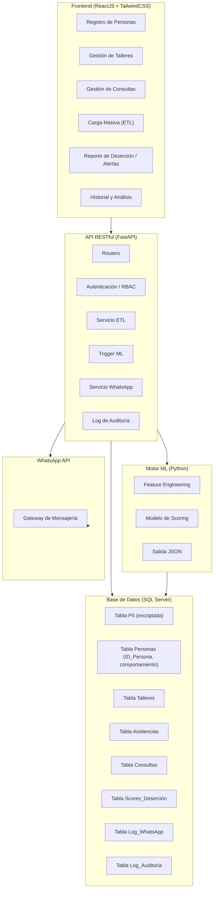
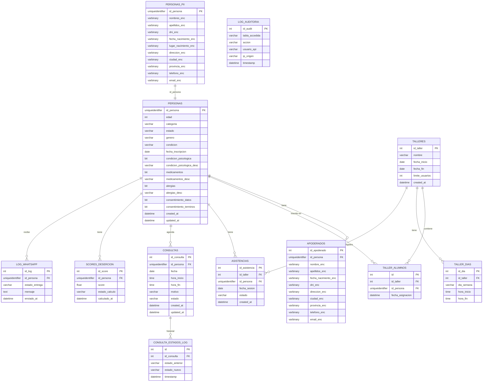

# Documento de Diseño — Sistema Mente Oasis

## Visión General

El Sistema Mente Oasis es una plataforma de gestión y análisis predictivo para **Mente Oasis Servicios Psicológicos**. Reemplaza el flujo de trabajo basado en archivos dispersos (Excel, hojas sueltas) por una plataforma centralizada que combina:

- Gestión interna de personas (pacientes/alumnos), talleres y consultas
- Pipeline ETL para carga masiva de datos históricos (.xls/.csv)
- Motor de Machine Learning para scoring de riesgo de deserción
- Sistema de alertas vía WhatsApp para intervención proactiva

El despliegue inicial es **local**. La arquitectura es agnóstica a la infraestructura para facilitar migración futura a la nube (AWS).

La protección de datos de salud mental es el pilar central: los datos PII se almacenan encriptados y el Motor ML opera exclusivamente sobre identificadores anónimos (UUID).

---

## Arquitectura

### Diagrama de Componentes



### Flujo de Datos Principal

```mermaid
sequenceDiagram
    participant E as Especialista
    participant FE as Frontend
    participant API as API (FastAPI)
    participant DB as SQL Server
    participant ML as Motor ML
    participant WA as WhatsApp API

    E->>FE: Registra Persona / carga archivo
    FE->>API: POST /personas o POST /etl/upload
    API->>DB: Encripta PII → tabla PII; inserta ID_Persona → tabla comportamiento
    E->>FE: Ejecuta análisis ML
    FE->>API: POST /ml/run
    API->>ML: Invoca script Python con datos anónimos
    ML->>DB: Lee asistencias/consultas por ID_Persona
    ML->>DB: Escribe scores JSON
    ML-->>API: Retorna JSON {ID_Persona, Score_Deserción}
    API-->>FE: Scores actualizados
    FE-->>E: Muestra reporte de deserción
    E->>FE: Envía alerta WhatsApp
    FE->>API: POST /alertas/whatsapp
    API->>WA: Envía mensaje
    WA-->>API: Estado de entrega
    API->>DB: Registra envío en Log_WhatsApp
```

### Decisiones de Diseño

| Decisión | Elección | Justificación |
|---|---|---|
| Backend | FastAPI (Python) | Integración nativa con scripts ML Python; alto rendimiento async; tipado con Pydantic |
| Base de datos | Microsoft SQL Server | Requisito del cliente; soporte robusto para encriptación TDE/columnar |
| Encriptación PII | AES-256 a nivel de columna (SQL Server Always Encrypted) | Protección en reposo; el motor ML nunca ve texto plano |
| Separación PII / comportamiento | Tablas físicamente separadas | El Motor ML solo tiene permisos sobre tablas de comportamiento |
| Frontend | ReactJS + TailwindCSS | Requisito del cliente |
| ML | Scripts Python (scikit-learn / XGBoost) | Flexibilidad; integración directa con FastAPI |
| Serialización | JSON (Pydantic models) | Estándar; validación automática; round-trip garantizado |

---

## Componentes e Interfaces

### API — Endpoints Principales

#### Personas
| Método | Ruta | Descripción |
|---|---|---|
| POST | `/api/v1/personas` | Registrar nueva Persona |
| GET | `/api/v1/personas/{id_persona}` | Obtener Persona (PII desencriptado, solo Especialista) |
| PUT | `/api/v1/personas/{id_persona}` | Actualizar datos de Persona |
| GET | `/api/v1/personas/{id_persona}/historial` | Historial de asistencias y consultas |

#### Talleres
| Método | Ruta | Descripción |
|---|---|---|
| POST | `/api/v1/talleres` | Crear Taller |
| GET | `/api/v1/talleres` | Listar Talleres |
| POST | `/api/v1/talleres/{id_taller}/alumnos` | Asignar Persona a Taller |
| POST | `/api/v1/talleres/{id_taller}/asistencias` | Registrar asistencia de sesión |

#### Consultas
| Método | Ruta | Descripción |
|---|---|---|
| POST | `/api/v1/consultas` | Agendar Consulta |
| PUT | `/api/v1/consultas/{id_consulta}/estado` | Cambiar estado de Consulta |

#### ETL
| Método | Ruta | Descripción |
|---|---|---|
| POST | `/api/v1/etl/upload` | Cargar archivo .xls/.csv |
| GET | `/api/v1/etl/jobs/{job_id}` | Consultar resultado del proceso ETL |

#### ML
| Método | Ruta | Descripción |
|---|---|---|
| POST | `/api/v1/ml/run` | Ejecutar Motor ML manualmente |
| GET | `/api/v1/ml/scores` | Obtener scores actuales |
| PUT | `/api/v1/ml/schedule` | Configurar ejecución automática |

#### Alertas
| Método | Ruta | Descripción |
|---|---|---|
| GET | `/api/v1/alertas/reporte` | Reporte de personas en riesgo (umbral configurable) |
| POST | `/api/v1/alertas/whatsapp` | Enviar mensaje WhatsApp manual |
| PUT | `/api/v1/alertas/config` | Configurar umbral y automatización |

### Motor ML — Interfaz

El Motor ML es invocado por la API como subproceso Python o mediante una cola de tareas (Celery/APScheduler para ejecución periódica).

**Entrada:** Consulta SQL sobre tablas de comportamiento (sin PII)
**Salida:** Array JSON `[{ "id_persona": "uuid", "score_desercion": 75.3, "estado": "calculado" | "datos_insuficientes" }]`

### Servicio WhatsApp

Integración con la API de WhatsApp Business (Meta) o proveedor alternativo (Twilio). La API actúa como intermediario: resuelve el número de teléfono desde la tabla PII encriptada, envía el mensaje y registra el resultado.

---

## Modelos de Datos

### Diagrama Entidad-Relación



### Esquema de Separación PII / Comportamiento

La separación física es la garantía de privacidad del Motor ML:

- **`PERSONAS_PII`**: Todos los campos de identificación personal, almacenados como `varbinary` encriptados con SQL Server Always Encrypted. Solo accesible por la API con el certificado de encriptación.
- **`PERSONAS`**: Datos de comportamiento y metadatos no-PII (edad calculada, categoría, estado, consentimientos). Esta tabla es la fuente del Motor ML.
- **`APODERADOS`**: PII del apoderado, también encriptado.

El Motor ML tiene permisos de lectura **únicamente** sobre: `PERSONAS`, `ASISTENCIAS`, `CONSULTAS`, `TALLER_ALUMNOS`. No tiene permisos sobre `PERSONAS_PII` ni `APODERADOS`.

### Modelos Pydantic (API)

```python
# Modelo de creación de Persona (entrada API)
class PersonaCreate(BaseModel):
    nombres: str
    apellidos: str
    fecha_nacimiento: date
    lugar_nacimiento: str
    direccion: str
    ciudad: str
    provincia: str
    telefono: str
    dni: str
    categoria: Literal["Paciente", "Alumno", "Paciente y Alumno"]
    estado: Literal["Activo", "Inactivo"]
    genero: str
    condicion: Optional[str]
    fecha_inscripcion: date
    condicion_psicologica: bool
    condicion_psicologica_desc: Optional[str]
    medicamentos: bool
    medicamentos_desc: Optional[str]
    alergias: bool
    alergias_desc: Optional[str]
    apoderado: Optional[ApoderadoCreate]
    consentimiento_datos: bool
    consentimiento_terminos: bool

# Modelo de score ML (salida Motor ML → API)
class ScoreDesercion(BaseModel):
    id_persona: UUID
    score: Optional[float]  # None si datos insuficientes
    estado_calculo: Literal["calculado", "datos_insuficientes"]

# Modelo de resultado ETL
class ETLResult(BaseModel):
    job_id: str
    registros_insertados: int
    registros_con_error: int
    errores: List[ETLError]
```


---

## Propiedades de Corrección

*Una propiedad es una característica o comportamiento que debe mantenerse verdadero en todas las ejecuciones válidas del sistema — esencialmente, una declaración formal sobre lo que el sistema debe hacer. Las propiedades sirven como puente entre las especificaciones legibles por humanos y las garantías de corrección verificables por máquina.*

---

### Propiedad 1: Round-trip de registro de Persona

*Para cualquier* conjunto válido de datos de Persona (incluyendo información general, médica y del apoderado), crear la Persona y luego recuperarla por su ID_Persona debe producir un objeto equivalente al original, con todos los campos presentes y sin pérdida de datos.

**Valida: Requisitos 1.1, 1.5, 1.6, 1.7**

---

### Propiedad 2: Cálculo correcto de edad

*Para cualquier* fecha de nacimiento válida, la edad calculada y almacenada por el sistema debe ser igual a la diferencia en años completos entre la fecha de nacimiento y la fecha actual.

**Valida: Requisito 1.2**

---

### Propiedad 3: Validación de enumeraciones de Persona

*Para cualquier* valor de categoría fuera del conjunto `{"Paciente", "Alumno", "Paciente y Alumno"}` o cualquier valor de estado fuera del conjunto `{"Activo", "Inactivo"}`, el sistema debe rechazar el registro y retornar un error de validación.

**Valida: Requisitos 1.3, 1.4**

---

### Propiedad 4: Obligatoriedad de consentimientos

*Para cualquier* intento de registro de Persona donde al menos uno de los dos consentimientos (`consentimiento_datos` o `consentimiento_terminos`) sea `false`, el sistema debe bloquear el guardado y retornar un mensaje indicando los consentimientos pendientes.

**Valida: Requisitos 1.8, 1.9**

---

### Propiedad 5: Unicidad de DNI

*Para cualquier* par de intentos de registro con el mismo DNI, el segundo intento debe ser rechazado con un mensaje de error indicando que el DNI ya está registrado, y la base de datos debe contener exactamente un registro con ese DNI.

**Valida: Requisito 1.10**

---

### Propiedad 6: Round-trip de creación de Taller

*Para cualquier* conjunto válido de datos de Taller (nombre, fechas, límite, días con horarios), crear el Taller y luego recuperarlo por su identificador debe producir un objeto equivalente al original.

**Valida: Requisito 2.1**

---

### Propiedad 7: Validación de fechas de Taller

*Para cualquier* Taller donde la fecha de finalización sea anterior o igual a la fecha de inicio, el sistema debe rechazar la creación con un error de validación y no persistir el registro.

**Valida: Requisito 2.2**

---

### Propiedad 8: Invariante de capacidad de Taller

*Para cualquier* Taller con `n` alumnos asignados donde `n >= limite_usuarios`, cualquier intento adicional de asignación debe ser rechazado, y el número de alumnos asignados al Taller debe permanecer en `n`.

**Valida: Requisito 2.4**

---

### Propiedad 9: Validación de categoría para asignación y consultas

*Para cualquier* Persona con categoría exclusivamente `"Paciente"`, el sistema debe rechazar su asignación a un Taller. *Para cualquier* Persona con categoría exclusivamente `"Alumno"`, el sistema debe rechazar el agendamiento de una Consulta. Solo las categorías correctas (`"Alumno"` o `"Paciente y Alumno"` para talleres; `"Paciente"` o `"Paciente y Alumno"` para consultas) deben ser aceptadas.

**Valida: Requisitos 2.3, 2.5, 3.1**

---

### Propiedad 10: Invariante de separación PII — el Motor ML nunca accede a PII

*Para cualquier* ejecución del Motor ML, el conjunto de datos de entrada debe contener únicamente campos `ID_Persona` y datos de comportamiento (fechas de sesión, estados de asistencia, estados de consulta). Ningún campo PII (nombres, apellidos, DNI, fecha de nacimiento, dirección, teléfono, email) debe estar presente en los datos accesibles por el Motor ML.

**Valida: Requisitos 2.6, 3.5, 5.3, 7.2**

---

### Propiedad 11: Registro de cambios de estado de Consulta

*Para cualquier* cambio de estado de una Consulta, la tabla `CONSULTA_ESTADOS_LOG` debe contener una entrada con el estado anterior, el estado nuevo y una marca de tiempo correspondiente al momento del cambio.

**Valida: Requisito 3.4**

---

### Propiedad 12: Conservación de filas en ETL

*Para cualquier* archivo cargado con `N` filas totales, la suma de `registros_insertados + registros_con_error` en el resultado del ETL debe ser igual a `N`. Ninguna fila debe perderse silenciosamente.

**Valida: Requisito 4.4**

---

### Propiedad 13: Estructura del resumen ETL

*Para cualquier* ejecución del proceso ETL, el resultado retornado por la API debe contener los campos `registros_insertados` (entero ≥ 0), `registros_con_error` (entero ≥ 0) y `errores` (lista con detalle de cada fila fallida).

**Valida: Requisito 4.5**

---

### Propiedad 14: Anonimización en ETL

*Para cualquier* registro procesado por el ETL, el dato almacenado en las tablas de comportamiento (`PERSONAS`, `ASISTENCIAS`) debe estar identificado únicamente por `ID_Persona` (UUID), sin que ningún campo PII en texto plano sea accesible desde esas tablas.

**Valida: Requisito 4.3**

---

### Propiedad 15: Rango del Score de Deserción

*Para cualquier* `ID_Persona` con historial de asistencia suficiente, el `Score_Deserción` generado por el Motor ML debe ser un valor numérico en el intervalo cerrado `[0, 100]`.

**Valida: Requisito 5.2**

---

### Propiedad 16: Round-trip de resultados ML (estructura y persistencia)

*Para cualquier* resultado JSON válido generado por el Motor ML con campos `id_persona` y `score_desercion`, serializar ese resultado, almacenarlo en la BD y luego recuperarlo vía API debe producir un objeto con valores numéricamente equivalentes al original, sin pérdida de precisión.

**Valida: Requisitos 5.4, 5.5, 9.1, 9.2, 9.3**

---

### Propiedad 17: Manejo de datos insuficientes en ML (caso borde)

*Para cualquier* `ID_Persona` sin historial de asistencia o con historial insuficiente para calcular un score, el Motor ML debe producir un resultado con `score = null` y `estado_calculo = "datos_insuficientes"`, sin lanzar una excepción ni omitir el registro del resultado.

**Valida: Requisito 5.8**

---

### Propiedad 18: Corrección del filtro del reporte de deserción

*Para cualquier* umbral configurable `T` y cualquier conjunto de scores almacenados, el reporte de deserción debe contener exactamente las Personas cuyo `Score_Deserción > T`, ni más ni menos, y cada entrada debe incluir nombre, categoría y score.

**Valida: Requisitos 6.1, 6.2**

---

### Propiedad 19: Persistencia del log de WhatsApp

*Para cualquier* mensaje de WhatsApp enviado (exitoso o fallido), la tabla `LOG_WHATSAPP` debe contener una entrada con `id_persona`, `estado_entrega`, `mensaje` y `enviado_at` (marca de tiempo).

**Valida: Requisito 6.7**

---

### Propiedad 20: Notificación de fallo de WhatsApp

*Para cualquier* intento de envío de WhatsApp que resulte en error, la respuesta de la API debe contener un campo de error con el motivo del fallo, y el Frontend debe mostrar ese mensaje sin romper la interfaz.

**Valida: Requisito 6.8**

---

### Propiedad 21: Encriptación de PII en reposo

*Para cualquier* Persona registrada, leer directamente las columnas PII de la tabla `PERSONAS_PII` en la base de datos (sin pasar por la capa de desencriptación de la API) debe retornar valores binarios encriptados, no texto plano legible.

**Valida: Requisito 7.1**

---

### Propiedad 22: Control de acceso a PII

*Para cualquier* solicitud a un endpoint que retorne datos PII desencriptados, si el token de autenticación no corresponde a un usuario con rol `Especialista`, la API debe retornar un error `403 Forbidden` y no incluir ningún campo PII en la respuesta.

**Valida: Requisito 7.3**

---

### Propiedad 23: Log de auditoría por acceso no autorizado

*Para cualquier* intento de acceso a la tabla `PERSONAS_PII` por un proceso o usuario sin los permisos correspondientes, la tabla `LOG_AUDITORIA` debe registrar una entrada con la acción, el origen y la marca de tiempo del intento.

**Valida: Requisito 7.5**

---

### Propiedad 24: Orden cronológico e integridad del historial

*Para cualquier* Persona, la vista de historial recuperada por la API debe contener todos sus registros de asistencias y consultas ordenados cronológicamente (ascendente por fecha), y los filtros aplicados (rango de fechas, categoría, nombre de taller) deben retornar únicamente registros que cumplan todos los criterios simultáneamente.

**Valida: Requisitos 8.1, 8.3, 8.4**

---

### Propiedad 25: Corrección de métricas de deserción por Taller

*Para cualquier* Taller con `N` alumnos asignados y `D` alumnos que abandonaron, el porcentaje de deserción calculado debe ser igual a `(D / N) * 100`, con precisión de al menos dos decimales.

**Valida: Requisito 8.2**

---

### Propiedad 26: Round-trip ETL (serialización y lectura desde BD)

*Para cualquier* registro válido procesado por el ETL, serializar el registro al formato estandarizado, insertarlo en la BD y luego leerlo de vuelta debe producir un objeto con todos los campos equivalentes al original, sin pérdida ni corrupción de datos.

**Valida: Requisitos 9.4, 9.5**

---

### Propiedad 27: Manejo de JSON malformado en Frontend

*Para cualquier* respuesta JSON recibida por el Frontend con estructura inesperada o campos obligatorios faltantes, la interfaz debe mostrar un mensaje de error descriptivo y permanecer funcional (sin crash ni estado inconsistente).

**Valida: Requisito 9.6**

---

## Manejo de Errores

### Estrategia General

Todos los errores son retornados por la API en un formato JSON estandarizado:

```json
{
  "error": {
    "code": "VALIDATION_ERROR",
    "message": "El DNI ya está registrado en el sistema.",
    "details": {}
  }
}
```

### Catálogo de Errores por Módulo

| Módulo | Código de Error | Causa | Respuesta HTTP |
|---|---|---|---|
| Registro | `DNI_DUPLICATE` | DNI ya existe en BD | 409 Conflict |
| Registro | `CONSENT_REQUIRED` | Consentimientos no aceptados | 422 Unprocessable Entity |
| Registro | `INVALID_CATEGORY` | Categoría fuera del enum | 422 |
| Talleres | `TALLER_DATE_INVALID` | Fecha fin < fecha inicio | 422 |
| Talleres | `TALLER_FULL` | Límite de usuarios alcanzado | 409 |
| Talleres | `INVALID_CATEGORY_TALLER` | Persona no es Alumno | 422 |
| Consultas | `INVALID_CATEGORY_CONSULTA` | Persona no es Paciente | 422 |
| ETL | `INVALID_FILE_FORMAT` | Formato de archivo no soportado | 400 |
| ETL | `PARTIAL_ERROR` | Filas con errores (proceso continúa) | 207 Multi-Status |
| ML | `ML_EXECUTION_ERROR` | Error interno del script Python | 500 |
| WhatsApp | `WA_SEND_FAILED` | Fallo en envío de mensaje | 502 Bad Gateway |
| Auth | `UNAUTHORIZED` | Token inválido o expirado | 401 |
| Auth | `FORBIDDEN_PII` | Acceso a PII sin rol Especialista | 403 |

### Manejo de Errores en ETL

El ETL implementa procesamiento tolerante a fallos: una fila inválida no detiene el proceso. Cada fila con error se registra en el log con:
- Número de fila
- Motivo del error
- Datos originales de la fila (para revisión)

El proceso retorna `207 Multi-Status` cuando hay una mezcla de éxitos y errores.

### Manejo de Errores en Motor ML

Si el script Python falla completamente (excepción no controlada), la API registra el error en el log de auditoría y retorna `500` al Frontend con un mensaje descriptivo. Los scores anteriores en la BD no son modificados.

### Manejo de Errores en Frontend

El Frontend implementa un boundary de errores global que captura respuestas inesperadas de la API y muestra un mensaje descriptivo sin romper la interfaz. Los errores de parsing JSON son capturados y presentados al usuario.

---

## Estrategia de Testing

### Enfoque Dual: Tests Unitarios + Tests de Propiedades

Ambos tipos son complementarios y necesarios para cobertura completa:

- **Tests unitarios**: verifican ejemplos concretos, casos borde y condiciones de error
- **Tests de propiedades**: verifican propiedades universales sobre rangos amplios de entradas generadas aleatoriamente

### Tests Unitarios

Los tests unitarios se enfocan en:
- Ejemplos específicos que demuestran comportamiento correcto (ej: registro exitoso con datos válidos)
- Puntos de integración entre componentes (API ↔ BD, API ↔ ML)
- Casos borde y condiciones de error (DNI duplicado, archivo ETL vacío, JSON malformado)
- Verificación de esquema de BD (separación física PII / comportamiento)

Evitar escribir demasiados tests unitarios para casos cubiertos por tests de propiedades.

### Tests de Propiedades (Property-Based Testing)

**Librería seleccionada:**
- **Backend (Python/FastAPI):** `hypothesis` — librería estándar de PBT para Python
- **Frontend (JavaScript/React):** `fast-check` — librería de PBT para JavaScript/TypeScript

**Configuración:**
- Mínimo **100 iteraciones** por test de propiedad (configurado en `settings` de Hypothesis / `numRuns` de fast-check)
- Cada test debe referenciar la propiedad del documento de diseño en un comentario

**Formato de etiqueta:**
```
# Feature: mente-oasis-sistema, Propiedad {N}: {texto_de_la_propiedad}
```

**Mapeo de Propiedades a Tests:**

| Propiedad | Tipo | Librería | Descripción del Test |
|---|---|---|---|
| P1 | Round-trip | hypothesis | Generar PersonaCreate aleatoria → POST → GET → comparar |
| P2 | Invariante | hypothesis | Generar fecha_nacimiento aleatoria → verificar edad calculada |
| P3 | Error condition | hypothesis | Generar categoría/estado inválido → verificar rechazo |
| P4 | Error condition | hypothesis | Generar registro con consentimiento=False → verificar bloqueo |
| P5 | Invariante | hypothesis | Registrar misma Persona dos veces → verificar error en segunda |
| P6 | Round-trip | hypothesis | Generar TallerCreate aleatorio → POST → GET → comparar |
| P7 | Error condition | hypothesis | Generar Taller con fecha_fin < fecha_inicio → verificar rechazo |
| P8 | Invariante | hypothesis | Llenar Taller hasta límite → intentar asignar uno más → verificar rechazo |
| P9 | Error condition | hypothesis | Generar Persona con categoría incorrecta → intentar asignar/agendar → verificar rechazo |
| P10 | Invariante | hypothesis | Ejecutar ML → inspeccionar datos de entrada → verificar ausencia de PII |
| P11 | Round-trip | hypothesis | Cambiar estado de Consulta → verificar entrada en log con timestamp |
| P12 | Invariante | hypothesis | Generar archivo con N filas (mix válidas/inválidas) → verificar suma = N |
| P13 | Invariante | hypothesis | Ejecutar ETL → verificar estructura del resumen |
| P14 | Invariante | hypothesis | Procesar ETL → verificar que tablas de comportamiento no contienen PII |
| P15 | Invariante | hypothesis | Ejecutar ML con datos suficientes → verificar score ∈ [0, 100] |
| P16 | Round-trip | hypothesis | Generar resultado ML → serializar → almacenar → recuperar → comparar |
| P17 | Edge case | hypothesis | Ejecutar ML con ID_Persona sin historial → verificar score=null y estado="datos_insuficientes" |
| P18 | Invariante | hypothesis | Generar scores aleatorios y umbral T → verificar reporte contiene exactamente scores > T |
| P19 | Round-trip | hypothesis | Enviar mensaje WA → verificar entrada en LOG_WHATSAPP |
| P20 | Error condition | hypothesis | Simular fallo WA → verificar respuesta contiene motivo de error |
| P21 | Invariante | hypothesis | Registrar Persona → leer columnas PII directamente en BD → verificar valores binarios |
| P22 | Error condition | hypothesis | Solicitar PII sin token Especialista → verificar 403 |
| P23 | Invariante | hypothesis | Simular acceso no autorizado a PERSONAS_PII → verificar entrada en LOG_AUDITORIA |
| P24 | Invariante | hypothesis | Generar historial aleatorio → verificar orden cronológico y corrección de filtros |
| P25 | Invariante | hypothesis | Generar datos de Taller con N alumnos y D deserciones → verificar porcentaje = D/N*100 |
| P26 | Round-trip | hypothesis | Generar registro ETL → serializar → insertar en BD → leer → comparar |
| P27 | Error condition | fast-check | Generar JSON malformado → verificar mensaje de error sin crash |

**Ejemplo de test de propiedad (Python/hypothesis):**

```python
from hypothesis import given, settings
import hypothesis.strategies as st

# Feature: mente-oasis-sistema, Propiedad 15: Score de Deserción en rango [0, 100]
@given(id_persona=st.uuids(), asistencias=st.lists(st.builds(AsistenciaFactory), min_size=5))
@settings(max_examples=100)
def test_score_range_invariant(id_persona, asistencias):
    score_result = motor_ml.calcular_score(id_persona, asistencias)
    assert score_result.estado_calculo == "calculado"
    assert 0 <= score_result.score <= 100
```

**Ejemplo de test de propiedad (JavaScript/fast-check):**

```typescript
// Feature: mente-oasis-sistema, Propiedad 27: JSON malformado no rompe la interfaz
import fc from "fast-check";

test("malformed JSON shows error without crash", () => {
  fc.assert(
    fc.property(fc.anything(), (malformedData) => {
      const result = parseApiResponse(malformedData);
      expect(result.hasError).toBe(true);
      expect(result.errorMessage).toBeTruthy();
      expect(result.interfaceBroken).toBe(false);
    }),
    { numRuns: 100 }
  );
});
```

### Cobertura de Tests

- Cada Propiedad de Corrección (P1–P27) debe ser implementada por **exactamente un test de propiedad**
- Los tests unitarios complementan cubriendo ejemplos concretos e integraciones
- Los tests de seguridad (P21, P22, P23) requieren un entorno de BD de prueba con datos reales encriptados
